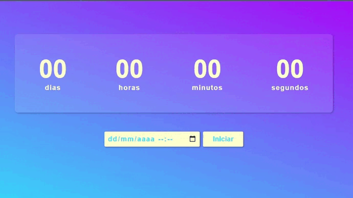

# Projeto | Countdown Timer

### Desenvolvido como projeto de estudo.

### Focos de estudo: regex, armazenamento em localStorage e o uso de classes.

Confira o resultado [clicando aqui](https://jeanwisotscki.github.io/countdown/) (Dica: control + click para abrir o link em uma nova guia. 😉)

# Preview do projeto

# Techs usadas no desenvolvimento

- HTML
- CSS
- JS
- GIT

# Desenvolvido por

- [@jeanwisotscki](https://github.com/jeanwisotscki/)
